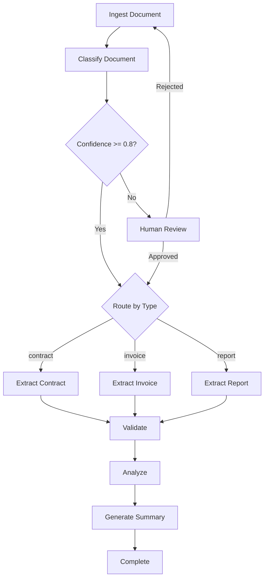

# LangGraph Document Processing Agent

[](https://www.python.org/downloads/)
[](https://github.com/langchain-ai/langgraph)
[](https://fastapi.tiangolo.com/)
[](LICENSE)

An intelligent document processing pipeline built on LangGraph. Classifies documents (contracts, invoices, reports), extracts structured data via type-specific LLM chains, validates results, and surfaces insights through a human-in-the-loop review workflow.

## Workflow



## Features

- **Multi-type classification** with confidence scoring and automatic routing
- **Type-specific extraction** chains for contracts, invoices, and quarterly reports
- **Numeric validation** tools (line item totals, percentage changes, arithmetic)
- **Text extraction** tools (date parsing, amount extraction, paragraph search)
- **Human-in-the-loop** review for low-confidence classifications
- **Full execution trace** with per-node timing, cost tracking, and error capture
- **Snapshot/rollback** persistence (Redis primary, in-memory fallback)
- **REST API** with async job processing and status polling
- **Multi-provider LLM support** — OpenAI, AWS Bedrock, Azure OpenAI, GCP Vertex AI

## Supported LLM Providers

| Provider | Models | Config |
|----------|--------|--------|
| OpenAI | GPT-4o, GPT-4-turbo | Set `OPENAI_API_KEY` |
| AWS Bedrock | Claude 3 Sonnet/Opus | Set AWS credentials |
| Azure OpenAI | Any deployment | Set `AZURE_OPENAI_ENDPOINT` |
| GCP Vertex AI | Gemini 1.5 Pro | Set `GCP_PROJECT_ID` |

Switch providers via `llm_provider` in config or env var. All nodes use dependency injection — no code changes needed.

## Quick Start

```bash
# Clone and install
git clone <repo-url> && cd langgraph-agent
pip install -r requirements.txt

# Configure
cp .env.example .env
# Edit .env with your API keys

# Run the API server
uvicorn src.api.routes:app --host 0.0.0.0 --port 8000 --reload

# Run the demo
python examples/demo.py

# Run tests
pytest
```

## API Reference

### Health Check

```bash
curl http://localhost:8000/health
```

```json
{"status": "ok", "redis_connected": false, "pending_jobs": 0}
```

### Analyze Document

```bash
curl -X POST http://localhost:8000/analyze \
  -H "Content-Type: application/json" \
  -d '{"document_text": "This Services Agreement is entered into..."}'
```

```json
{"job_id": "a1b2c3d4e5f67890", "status": "pending", "document_type": "unknown"}
```

### Get Job Status

```bash
curl http://localhost:8000/jobs/a1b2c3d4e5f67890
```

```json
{
  "job_id": "a1b2c3d4e5f67890",
  "status": "complete",
  "document_type": "contract",
  "requires_review": false,
  "created_at": "2025-01-15T10:30:00Z",
  "updated_at": "2025-01-15T10:30:05Z"
}
```

### Approve / Reject Review

```bash
# Approve
curl -X POST http://localhost:8000/jobs/a1b2c3d4e5f67890/approve \
  -H "Content-Type: application/json" \
  -d '{"feedback": "Confirmed as contract"}'

# Reject
curl -X POST http://localhost:8000/jobs/a1b2c3d4e5f67890/reject \
  -H "Content-Type: application/json" \
  -d '{"feedback": "Misclassified — this is an invoice"}'
```

## State Schema

| Field | Type | Description |
|-------|------|-------------|
| `job_id` | `str` | Unique job identifier |
| `document_text` | `str` | Raw input document |
| `document_type` | `Literal["contract","invoice","report","unknown"]` | Classified type |
| `classification_confidence` | `float` | 0.0 - 1.0 confidence score |
| `extracted_data` | `dict` | Type-specific structured extraction |
| `validation_results` | `list` | Validation check outcomes |
| `analysis` | `dict` | Analysis findings |
| `risks` | `list` | Identified risk items |
| `anomalies` | `list` | Detected anomalies |
| `insights` | `list` | Generated insights |
| `summary` | `str` | Final text summary |
| `status` | `Literal[...]` | Pipeline stage (pending through complete) |
| `requires_review` | `bool` | Human review flag |
| `review_feedback` | `str` | Reviewer notes |
| `approved` | `bool` | Review approval status |
| `trace` | `list[TraceStep]` | Execution trace records |
| `total_cost` | `float` | Cumulative LLM cost |
| `errors` | `list` | Error messages |
| `created_at` | `str` | ISO 8601 creation timestamp |
| `updated_at` | `str` | ISO 8601 last update timestamp |

## Adding New Document Types

1. **Define the extraction schema** in `src/agents/nodes/extractor.py`:
   ```python
   def extract_memo(state: DocumentState) -> dict:
       schema_prompt = (
           "Extract the following from this memo as JSON:\n"
           '{"author": "<name>", "recipients": ["<names>"], ...}'
       )
       return _invoke_extraction(state, schema_prompt, "extract_memo")
   ```

2. **Register the route** in `route_extraction()`:
   ```python
   mapping = {
       "contract": "extract_contract",
       "invoice": "extract_invoice",
       "report": "extract_report",
       "memo": "extract_memo",  # new
   }
   ```

3. **Update the classifier prompt** in `src/agents/nodes/classifier.py` to include the new type in the classification options.

4. **Add the type to the schema** in `src/state/schema.py`:
   ```python
   document_type: Literal["contract", "invoice", "report", "memo", "unknown"]
   ```

5. **Add the node to the graph** conditional edge map and register it in `src/agents/nodes/__init__.py`.

## Adding New Tools

1. Create a new module in `src/tools/` (e.g., `src/tools/sentiment.py`):
   ```python
   def analyze_sentiment(text: str) -> dict:
       """Return sentiment score and label."""
       ...
   ```

2. Export from `src/tools/__init__.py`.

3. Bind to the LLM tool chain or call directly from a graph node.

## Trace Visualization

Each node execution produces a `TraceStep` record:

```json
[
  {
    "node_name": "classify_document",
    "started_at": "2025-01-15T10:30:00.123Z",
    "completed_at": "2025-01-15T10:30:01.456Z",
    "duration_ms": 1333.0,
    "input_keys": ["document_text"],
    "output_keys": ["document_type", "classification_confidence", "status"],
    "cost": 0.0023,
    "error": ""
  },
  {
    "node_name": "extract_contract",
    "started_at": "2025-01-15T10:30:01.460Z",
    "completed_at": "2025-01-15T10:30:03.210Z",
    "duration_ms": 1750.0,
    "input_keys": ["document_text", "document_type"],
    "output_keys": ["extracted_data", "status"],
    "cost": 0.0041,
    "error": ""
  }
]
```

## Docker Deployment

```dockerfile
FROM python:3.11-slim

WORKDIR /app
COPY requirements.txt .
RUN pip install --no-cache-dir -r requirements.txt

COPY . .

EXPOSE 8000
CMD ["uvicorn", "src.api.routes:app", "--host", "0.0.0.0", "--port", "8000"]
```

```bash
# Build and run
docker build -t langgraph-agent .
docker run -p 8000:8000 \
  -e OPENAI_API_KEY=sk-... \
  -e REDIS_URL=redis://redis:6379/0 \
  langgraph-agent

# With docker-compose (Redis included)
docker-compose up
```

## Testing

```bash
# Run all tests
pytest

# Run with verbose output
pytest -v

# Run specific test module
pytest tests/test_state.py
pytest tests/test_tools.py
pytest tests/test_nodes.py
pytest tests/test_api.py

# Run with coverage
pytest --cov=src --cov-report=term-missing
```

## Project Structure

```
langgraph-agent/
├── src/
│   ├── __init__.py
│   ├── config.py                  # AppConfig with env loading
│   ├── agents/
│   │   ├── __init__.py
│   │   └── nodes/
│   │       ├── __init__.py
│   │       ├── _llm.py            # Shared LLM factory
│   │       ├── classifier.py      # Document classification node
│   │       ├── extractor.py       # Type-specific extraction nodes
│   │       ├── validator.py       # Validation node
│   │       ├── analyzer.py        # Analysis node
│   │       └── human_review.py    # Human-in-the-loop nodes
│   ├── llm/
│   │   ├── __init__.py
│   │   ├── provider.py              # Provider factory and base interface
│   │   ├── openai.py                # OpenAI provider
│   │   ├── bedrock.py               # AWS Bedrock provider
│   │   ├── azure.py                 # Azure OpenAI provider
│   │   └── vertex.py                # GCP Vertex AI provider
│   ├── api/
│   │   ├── __init__.py
│   │   ├── models.py              # Pydantic request/response models
│   │   └── routes.py              # FastAPI endpoints
│   ├── state/
│   │   ├── __init__.py
│   │   ├── schema.py              # DocumentState TypedDict + TraceStep
│   │   └── persistence.py         # Redis + in-memory persistence
│   └── tools/
│       ├── __init__.py
│       ├── calculator.py          # Arithmetic, totals, percentages
│       └── extractor.py           # Date, amount, paragraph extraction
├── tests/
│   ├── __init__.py
│   ├── conftest.py                # Shared fixtures
│   ├── test_state.py              # State + persistence tests
│   ├── test_tools.py              # Calculator + extractor tool tests
│   ├── test_nodes.py              # Node tests with mocked LLM
│   └── test_api.py                # FastAPI endpoint tests
├── examples/
│   ├── demo.py                    # End-to-end demo script
│   ├── sample_contract.txt
│   ├── sample_invoice.txt
│   └── sample_report.txt
├── pyproject.toml
├── requirements.txt
└── README.md
```

## License

MIT
